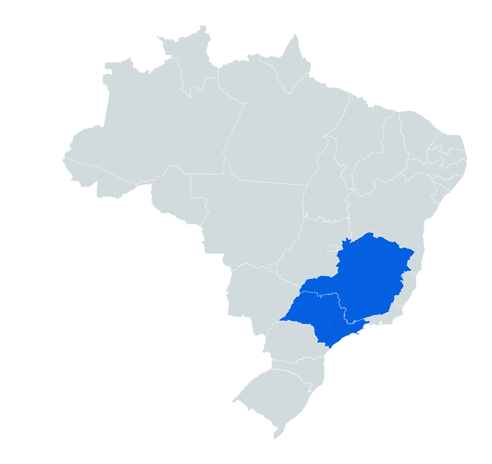

<h1 align="center">👋 Hi, I'm Lucas Koyama</h1>
<h3 align="center">&ltA Full-stack web developer interested in Web Apps, Data Science and Cybersecurity/&gt</h3>

- 🌱 I’m currently learning **full-stack web development at Trybe!!!**
- 👨‍💻 All of my projects are available at [https://lucaskoyama.github.io/](https://lucaskoyama.github.io/)
- 📫 Email: Lucaskoyamahhh@gmail.com || Cellphone: +55 (19) 99540-5067

 
<h3 align="center">Languages and Tools:</h3>

  <!--LINUX-->
  
  
  <!--GIT-->
  
  
  <!--HTML-->
  

  <!--CSS-->
  
  
   <!--JAVASCRIPT-->
  
  
  <!--CYPRESS-->
  
  
   <!--PYTHON-->
  
 

 
 
<h3 align="center">Github status</h3>

<h3 align="center">Connect with me:</h3>

  

 
<h3 align="center">Where my code reached</h3>

  

<!---
Lucaskoyamah/Lucaskoyamah is a ✨ special ✨ repository because its `README.md` (this file) appears on your GitHub profile.
You can click the Preview link to take a look at your changes.
--->
